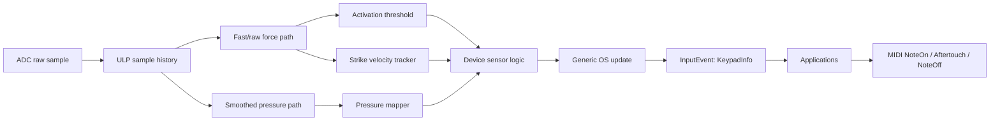

# Strike Velocity 输入管线计划

## 目标

MatrixOS 需要把压力键盘的两个演奏维度拆清楚：`pressure` 表示当前绝对压力，用于 aftertouch 和持续表达；`velocity` 表示当前输入事件的速度值。`velocity` 不新增字段，按事件语义复用：

- `Pressed`: `velocity` 是本次触发的 strike velocity。
- `Aftertouch` 和 `Hold`: `pressure` 持续更新，`velocity` 保留本次触发的 strike velocity。
- `Released`: `velocity` 继续复用同一个字段。第一版不单独计算 release velocity，先保留当前 strike velocity 或当前事件 velocity 语义即可。

应用层不应该再用 `pressure` 当 note-on velocity。正确消费方式是：Note On 读 `velocity`，Aftertouch 读 `pressure`。第一版 Note Off 可以继续保持现有发送方式，不要求消费单独的 release velocity。

## 当前状态

Mystrix1 FSR 路径现在是：

1. `Devices/Mystrix1/ULP/fsr_keypad.c` 持续扫描 8x8 ADC。
2. ULP 对每格结果做 IIR 滤波：`result = (result * 3 + reading) / 4`。
3. `Devices/Mystrix1/Drivers/KeypadFSR.cpp` 把 ULP 的 `result[x][y]` 转成 `Fract16 reading`。
4. 每格套 `lowThreshold`、`highThreshold`、`lowOffset`、`highOffset`。
5. `KeypadInfo::Update()` 把当前 reading 映射成 `pressure`，并在 `Pressed` / `Aftertouch` / `Released` 状态变化时发 `InputEvent`。

问题是 `KeypadInfo::velocity` 目前没有承载独立 strike velocity。许多 app 在 `Pressed` 时直接把 `pressure.to7bits()` 当 Note On velocity，导致快速轻击和慢压到同一压力值时表现接近，演奏手感不够像真正的力度键盘。

另一个结构性问题是 `KeypadInfo::Update()` 现在把几类职责混在一起了：阈值判断、debounce、pressure curve、hold、aftertouch 事件判定都在里面。FSR 这种需要 strike velocity、release velocity、压力曲线和采样历史的输入，确实不适合继续把传感器语义完全交给 OS 通用 updater；但 generic update 里和 OS 事件语义强绑定的部分，例如 `hold`、`lastEventTime`、`Pressed/Hold/Aftertouch/Released` 这套通用状态，仍然值得保留。更清晰的边界是：设备层负责把 raw force 处理成“已经去抖、已经过曲线、已经算出 velocity 的语义输入”，generic update 只负责 OS 侧通用状态推进和事件发射。

## 目标管线



核心原则：

- velocity 从触发初期的压力变化率计算。
- pressure 从当前绝对压力计算。
- ULP 可以用比 OS update 更高的实际扫描频率保存采样历史；OS 240 Hz 消费节奏不应该限制 velocity 计算窗口。
- 阈值、校准、曲线、去抖、发送限流各自分层，避免一个参数同时影响所有手感。

## KeypadInfo 契约

保持 `KeypadInfo` 的 app-facing 数据结构不扩字段：

```cpp
struct KeypadInfo {
  uint32_t lastEventTime;
  Fract16 pressure;
  Fract16 velocity;
  KeypadState state;
  ...
};
```

建议补充注释和文档语义：

- `pressure`: 当前绝对压力。`Pressed` 时是按下瞬间压力，`Aftertouch` 时持续变化，`Released` 时可以清零或保留最后值。
- `velocity`: 事件速度。`Pressed` 是 strike velocity，其他 active 状态保持 strike velocity；`Released` 第一版继续复用这个字段，但不单独计算 release velocity。
- `KeypadCapabilities.hasVelocity`: 只有当设备能产生独立 strike velocity 时才为 true。Mystrix1 Pro 完成实现后应为 true；binary keypad 仍为 false。

## 状态机所有权

FSR keypad 不应该再把 raw reading 直接丢给当前的 `KeypadInfo::Update()`。但也不建议把 hold / event timestamp / 通用状态推进整套复制到设备层。更合适的是把状态机拆成两层：

- 设备层拥有传感器语义：raw/filtered path、校准、activation/release threshold、debounce、velocity 计算、pressure curve。
- generic update 拥有 OS 通用语义：`lastEventTime`、`hold`、`Pressed/Hold/Aftertouch/Released` 这些对所有 keypad 类型都通用的事件状态。

也就是说，FSR 不是“停止调用 generic update”，而是“停止把未经处理的 raw value 交给 generic update 推断”。

推荐边界：

- `OS/Framework/Input/KeypadInfo.h`: 定义 `KeypadInfo`、`KeypadState`、capabilities 和字段语义。
- `OS/Framework/Input/KeypadInfo.cpp`: 改成轻量 generic helper，只负责基于“已处理输入”更新 `hold`、`lastEventTime` 和通用事件状态，不再负责 curve / debounce / FSR threshold 推断。
- `Devices/Mystrix1/Drivers/KeypadFSR.cpp`: 读取 ULP history、应用校准、计算 pressure/velocity、完成 debounce，再把语义化后的结果传给 generic update。
- `Devices/Mystrix1/Drivers/KeypadBinary.cpp`、FN、touchbar: 也可以继续走同一个 generic helper，只是它们的设备层预处理更简单。

这样仍然只有一套真实状态：`keypadState[x][y]`。但它的字段更新来源分层更清楚：设备层先填好传感器相关字段，再由 generic update 统一补上 OS 语义状态。

建议新增设备层内部状态：

```cpp
enum class FSRKeyState : uint8_t {
  Idle,
  DebouncingPress,
  CalculatingStrikeVelocity,
  Active,
  DebouncingRelease,
  CalculatingReleaseVelocity,
};
```

每格内部 runtime state 放在 `Devices/Mystrix1/Drivers/KeypadFSR.cpp`：

```cpp
struct FSRKeyRuntime {
  FSRKeyState state;
  uint32_t stateStartMs;
  uint32_t lastConsumedUlpFrame;
  uint8_t strikeStartIndex;
  uint8_t releaseStartIndex;
  Fract16 lastPressure;
  Fract16 strikeVelocity;
};
```

采样历史不需要复制到每个 key runtime。更合适的是由 ULP 保存每格 ring buffer，主 CPU runtime 只记录触发开始时的 history index，然后从 ULP history 中取前几个 scan 计算 velocity。

建议 generic update 的输入不要再是单个 `newValue`，而是一个已经语义化的 snapshot，例如：

```cpp
struct KeypadSemanticInput {
  bool active;
  bool pressEdge;
  bool releaseEdge;
  Fract16 pressure;
  Fract16 velocity;
};
```

名字可以后面再定，但核心是 generic update 只消费“设备层已经决定好的结果”，而不是重新参与 FSR 传感器判断。

### Pressed 流程

1. `Idle` 中 raw/fast force 超过 `lowThreshold + activationOffset`。
2. 进入 `DebouncingPress`，确认 3 到 8 ms 内没有回落。
3. 记录当前 ULP history index，进入 `CalculatingStrikeVelocity`。
4. 从 ULP history 读取触发后的 4 到 8 个 fast samples。即使 OS timer 是 240 Hz，也可以消费 ULP 已保存的更高频历史样本。
5. 计算 strike velocity，写入 `semanticInput.velocity`。
6. 同时用 smooth pressure path 计算 `semanticInput.pressure`，并设置 `semanticInput.pressEdge = true`。
7. 调用轻量 generic update，让它写入 `keypadState[x][y]`、更新 `lastEventTime`，并输出 `KeypadState::Pressed`。

### Aftertouch 流程

1. active 状态下持续更新 smooth pressure。
2. 设备层只负责给出最新 pressure；只有当最终 7-bit pressure 变化，或内部默认 threshold 认为变化有意义时，再调用 generic update。
3. `velocity` 保持本次 strike velocity，不随 aftertouch 改变。
4. generic update 在 active 状态里负责判断 `hold` 和 `Aftertouch` 这类 OS 语义事件。
5. aftertouch decimation 先作为工程默认值，不作为第一版用户设置暴露。

### Released 流程

1. active 状态下 fast/smooth force 低于 `lowThreshold` 或 release threshold。
2. 进入 `DebouncingRelease`，确认释放不是瞬时抖动。
3. 第一版不单独计算 release velocity。
4. 设备层生成 `releaseEdge = true`，并继续复用当前 `velocity` 字段。
5. generic update 负责把事件规范化成 `KeypadState::Released`，更新 `lastEventTime` 并清掉 `hold`。
6. `pressure` 可清零，避免应用误读 Released 的 pressure。

## Velocity 算法路线

### 第一阶段: 简化斜率

用触发初期的 fast samples 计算最大上升速度：

```cpp
delta = max(sample[i]) - sample[0];
elapsed = sampleCount - 1;
rawVelocity = delta / elapsed;
```

然后套 sensitivity curve 和 min/max：

```cpp
velocity = ApplyVelocityCurve(rawVelocity, velocitySensitivity);
velocity = Clamp(velocity, minVelocity, maxVelocity);
```

优点是实现简单，能快速验证手感方向。缺点是对噪声和首样本位置比较敏感。

### 第二阶段: 线性回归斜率

参考 LinnStrument，用前 N 个样本的线性回归斜率计算 strike velocity：

```text
slope = ((n * sumXY) - sumX * sumY) / ((n * sumXSquared) - sumX * sumX)
```

建议 N 从 5 或 6 开始。这里的 sample 来自 ULP history，不必等 OS 240 Hz timer 每次回调。实际延迟应该按 ULP frame rate 计算：

```text
latencyMs ~= sampleCount * 1000 / ulpFrameRate
```

如果 ULP 实际能稳定提供 800 Hz 到 1 kHz 级别的每格历史，6 samples 只需要约 6 到 8 ms，再加 OS 消费和 MIDI 发送延迟。第一版应先记录 `ulp_count` 和 OS scan timestamp，测出真实 ULP frame rate 后再定默认 sample count。

### Velocity 曲线

建议先提供 4 档：

- Fixed: 固定 velocity，例如 96 或 127。
- Low: 需要更快 strike 才到高 velocity。
- Medium: 默认。
- High: 轻快点击更容易出高 velocity。

实现上可以先用 piecewise linear 或查表，之后再换成 LinnStrument 式曲线表。

## Pressure 算法路线

pressure 模式第一版应该简单。用户不需要理解太多手感参数，只需要三类概念：

- Activation Threshold: 什么时候算按下。来自每格 low calibration 加全局 offset。
- Pressure Curve: 当前压力如何映射到 0 到 127，可以先提供 Linear / Soft / Hard / LogFast 或直接用一个默认曲线。
- Max Pressure: 多少压力映射到 127。来自每格 high calibration 加全局 offset。

设备层内部仍然可以保留 aftertouch threshold、decimation、release hysteresis 等工程参数，但不建议第一版暴露给用户。这样 UI 和调参路径更像乐器：先校准 activation 和 max，再选择一条 pressure curve。

pressure 输出建议：

```text
normalized = clamp((filteredForce - activationThreshold) / (maxPressure - activationThreshold), 0, 1)
pressure = ApplyPressureCurve(normalized)
```

如果用户想要传统 aftertouch 手感，可以后续再加一个高级 mode；第一版默认 continuous pressure，更符合网格控制器和 MPE 设备直觉。

## 从 LinnStrument 借鉴哪些 filter

这次回看 LinnStrument firmware，值得借鉴的不是“单一大滤波器”，而是几层分开的 filter / guard：采样稳定、触发资格、velocity 拟合、pressure 输出平滑、phantom 过滤。对 Mystrix1 更有价值的是下面这些点。

### 1. 采样稳定延时，不是盲目 IIR

LinnStrument 在读 Z 之前会根据当前列是否已有触点、raw Z 是否已经超过初始阈值，决定是否插入一次很短的 settling delay 再重读。这个思路的重点不是把所有值做平滑，而是先尽量拿到稳定样本，再进入后续判断。

对 Mystrix1 的启发：

- 如果 ULP/ADC 路径存在切换复用器后的首样本不稳定问题，优先做“首样本判别 + 有条件重采样”。
- 这类处理应该放在最靠近采样的位置，而不是交给 OS 层的 curve 或 aftertouch threshold 去掩盖。
- 如果当前 ULP 预算不够做二次采样，至少要把“首样本是否可信”单独记成实验项，而不是直接继续堆 IIR 长度。

进一步说，Mystrix1 很适合直接在 ULP 里做这个，而不是等主 CPU 补救：

- ULP 先读一次 fast sample。
- 如果这是 mux 切换后的首样本，或者读数已经高于一个初始稳定阈值，就插入一个很短的 settling delay。
- 然后立刻再读第 2 次，必要时读第 3 次。
- `rawHistory` 建议写入“稳定后的最终样本”，不要把明显不稳的首样本直接塞进 velocity history。
- 如果希望后续分析首样本误差，可以额外保留 `firstSample` 和 `stableSample` 的 debug 统计，但第一版不一定要长期持久化。

### 2. Feather touch 和真正按下分层

LinnStrument 把 `sensorFeatherZ` 和 `sensorLoZ` 分开：低于 feather 直接当无触点；高于 feather 但还没过 low threshold 时记为 feather touch；真正的 velocity / pressure 只有过了更高的有效门槛才成立。

对 Mystrix1 的启发：

- 我们现在的 activation threshold 更像 LinnStrument 的 `sensorLoZ`，但还缺一个更低一级的“弱接触观察区”。
- 第一版不一定要把 feather touch 暴露成用户功能，但设备层可以内部保留一个 pre-touch 区间，用来减少边缘抖动和误触发。
- 这比单纯扩大 debounce 更合理，因为它区分了“有接触”与“已触发”。

### 3. Velocity 用线性回归 + LUT，而不是直接差分

LinnStrument 的 strike velocity 不是只看两个样本差，而是累积多个 Z 样本做线性回归，再套不同 sensitivity LUT。这个我们前面已经决定采用，回看源码后可以更明确：

- 他们确实把 velocity 计算和 continuous pressure 分开。
- 他们用不同 sensitivity 对应不同曲线表，而不是一个线性缩放系数硬拉到底。

对 Mystrix1 的启发：

- `VelocityResponse` 最终应该落到 profile + LUT，不要只做一个乘法系数。
- 第一版可以先上线简化斜率版本，但 plan 里应明确第二版目标就是回归斜率 + curve table。

### 4. Pressure 输出侧做自适应 slew-rate 平滑

LinnStrument 有一段很值得学的处理：`handleZExpression()` 不是在 ADC 端一味低通，而是在输出 pressure 前根据横向移动速度和 pressure 变化幅度，动态调整 pressure 的平均速度。移动越快，pressure 越慢一点；静止时 pressure 响应几乎是即时的。

这个思路比单纯加大 IIR 更好，因为：

- 静止按压时不会显著损伤 aftertouch 跟手性。
- 横向滑动跨 cell 时能减轻 pressure 跳变。
- 平滑发生在表达层，不会污染 strike velocity 用的 raw path。

对 Mystrix1 的建议：

- raw history 继续专门给 strike/release velocity 用，不做这类平滑。
- filtered pressure path 之外，再加一个可选的 expression smoother，位置放在“pressure curve 之后、发送事件之前”。
- 这个 smoother 第一版先做工程默认，不暴露用户调参。
- 如果 Mystrix1 后面没有像 LinnStrument 那样的 X slide transfer，也仍然可以把它简化成“pressure delta 越大，平滑越少；小抖动时平滑越多”的自适应 aftertouch smoothing。

### 5. Phantom / transfer / pending release 是状态过滤，不是曲线

LinnStrument 还做了几类不该和 pressure curve 混在一起的过滤：

- rectangle phantom touch 检测
- 相邻 cell slide transfer
- pending release 延迟释放

这些逻辑本质上都是状态过滤器，不是传感器曲线。

对 Mystrix1 的启发：

- 如果后面发现 FSR 网格也有串扰、边缘拖尾、跨 pad 转移问题，不要试图用 pressure curve 或 debounce 一把梭去修。
- 应该单独设计 state filter，例如 release hysteresis、adjacent-cell suppression、pending release window。

### 结论

LinnStrument 值得学的 filter 方向，优先级我建议是：

1. velocity 的回归 + LUT 路线。
2. pressure 输出侧的自适应 smoothing。
3. feather / pre-touch 分层门槛。
4. 采样稳定性检查或有条件重采样。
5. 后续如果出现串扰，再补独立 state filter，而不是继续堆 pressure curve。

不建议直接照搬的部分：

- 他们为 X/Y/Z 三维连续控制服务的全部 transfer 逻辑。
- 跟大尺寸电阻膜矩阵强耦合的 phantom rectangle 规则。

我们更适合吸收它的原则：把“采样稳定”“触发资格”“velocity 拟合”“pressure 表达平滑”“状态过滤”拆开，各自放在正确层级，而不是指望一个 generic update 或一个 IIR 参数解决全部手感问题。

## 扫描刷新率规划

### 当前限制

Mystrix1 ULP 当前对每格 ADC 读数做 IIR length 4。这个路径适合稳定 pressure，但会削弱 strike velocity 的瞬态。主 CPU keypad timer 当前名义上 240 Hz，但 ULP 自身在 tight loop 中持续扫描并更新 `count`，实际可用于 velocity 的采样密度可以高很多。

### 推荐改动

1. ULP 增加每格 history ring buffer，例如 8 到 16 帧：
  - `rawHistory[historySize][X_SIZE][Y_SIZE]`: 最近 ADC 缩放值，用于 strike velocity。
  - `result[x][y]`: IIR 后的压力值，用于 pressure/aftertouch。
  - `historyIndex`: 当前写入位置。
  - `count`: ULP 完整扫描帧计数。
2. ULP 在每格采样时加入“可选 settling delay + 多采样确认”路径：
  - 默认先读 1 次。
  - 如果是通道切换后的首样本，或首样本已高于稳定阈值，就延时几个 ADC/ULP 周期再读第 2 次。
  - 如果第 1 次和第 2 次差异仍超过稳定阈值，可以允许第 3 次确认，但要受总 scan budget 限制。
  - 最终只把稳定后的样本写入 `rawHistory` 和 `result`。
3. 主 CPU 240 Hz update 时读取 `historyIndex` 和 `count`，一次消费 ULP 已积累的多个 scan。
4. activation 发生时记录 start index，不需要等待后续多个 OS tick 才能拿到前几个 ULP scan。
5. 把 pressure path 的 IIR length 改成可配置常量；velocity path 优先使用 raw history。
6. 先测 ULP 实际 scanrate，再评估是否需要把 `keypadScanrate` 从 240 提到 300 或 480 Hz。

建议把 ULP 采样结果分成三个概念，避免后续混掉：

- `firstSample`: mux 切换后立即读到的首样本，仅用于调试或稳定性判定。
- `stableSample`: 延时 / 多采样后选出的稳定样本，作为 raw velocity 数据源。
- `filteredSample`: 对 `stableSample` 做 IIR 后的值，作为 pressure 数据源。

这样可以保证：

- velocity 不会被明显错误的首样本污染。
- pressure 也不会为了补救不稳定首样本而被迫增加过重的 IIR。
- 后续可以独立评估“ADC settle 问题”和“pressure smoothing 手感”两类问题。

刷新率建议：

- 240 Hz OS update: 稳，CPU/MIDI 压力小；配合 ULP history 仍然可以计算高频 strike velocity。
- 300 Hz OS update: 可能降低事件分发延迟，是比较温和的实验目标。
- 480 Hz OS update: 需要确认 ADC settle、ULP 占用、主 CPU event 负载和 MIDI 输出限流。

不要只提高 OS update 频率。优先级应该是 ULP history、settling 多采样、raw/filtered path 分离；否则 IIR 仍会把 strike transient 抹掉，而且首样本不稳的问题也还在。

## 应用层迁移

需要统一以下规则：

```cpp
if (keypadInfo->state == KeypadState::Pressed) {
  velocity = forceSensitive ? keypadInfo->velocity.to7bits() : fixedVelocity;
  SendNoteOn(note, velocity);
}
else if (keypadInfo->state == KeypadState::Aftertouch) {
  pressure = keypadInfo->pressure.to7bits();
  SendAftertouch(note, pressure);
}
else if (keypadInfo->state == KeypadState::Released) {
  SendNoteOff(note, 0);
}
```

第一批需要改的 app：

- `Applications/Performance/8x8/Performance8x8.cpp`
- `Applications/Performance/8x8/UINotePad.h`
- `Applications/Note/NotePad.cpp`
- `Applications/Sequencer/NotePad.cpp`
- `Applications/PolyPlayground/PolyPad.h` 或相关 pad 事件入口

UI 文案和用户设置页不是这一轮主路径。第一版先允许 app 直接消费新的 `velocity` / `pressure` 语义，设置先 hardcode，后面再补 UI 文案和交互。

## 设置和校准

现有 Force Calibration 保留为硬件校准：

- Activation Force Calibration: 每格 low threshold。
- Force Max Calibration: 每格 high threshold。
- Activation Force Offset: 全局 low offset。
- Force Max Offset: 全局 high offset。
- Keypad Visualizer: 当前 pressure 可视化。

建议新增一个独立的用户层配置结构，专门描述演奏响应，而不是继续把用户手感参数塞进当前偏硬件语义的 `KeypadConfig`。

但实现顺序上，**不用一开始就做 UI**。更合适的落地方式是：

- 先定义配置结构和默认值。
- 第一版先在代码里 hardcode 默认 profile，让 pipeline 先跑通。
- 第二版再决定是否写入 NVS。
- 最后才补用户设置 UI。

建议命名：

- `UserKeypadConfig`: 面向用户设置和应用层语义，推荐作为主名字。
- `KeypadResponseConfig`: 如果想强调“演奏响应”而不是“用户设置”，这是另一个可接受名字。

不建议把 `VelocityCurve` 直接作为字段名，因为它更像“响应模型”而不是一条任意可编辑曲线。更清晰的命名是：

- `velocityResponse`: strike velocity 的响应模式。
- `pressureCurve`: pressure 的映射曲线。

建议草案：

```cpp
enum class VelocityResponse : uint8_t {
  Soft = 10,
  Balanced = 20,
  Hard = 30,
};

enum class PressureCurve : uint8_t {
  Linear = 10,
  Soft = 20,
  Hard = 30,
  LogFast = 40,
};

struct UserKeypadConfig {
  VelocityResponse velocityResponse;
  PressureCurve pressureCurve;
};
```

这里建议 **直接给真实数字编码**，不要依赖 enum 顺序。原因：

- NVS 持久化更稳定，后面插入新项不会把旧值含义全部打乱。
- 调试日志和 MIDI / serial debug 输出更直观，看到 `20` 就知道是 `Balanced` 或 `Soft` 这类明确配置，而不是“第二个枚举值”。
- 以后如果要兼容导入导出配置、SysEx、web-ui、设备间同步，数字协议值会更稳。

推荐规则：

- 预留间隔编码，使用 `10, 20, 30...`，不要用 `0, 1, 2...`。
- `0` 保留给 `Unknown / Uninitialized / Default fallback`。
- 新曲线以后插入 `15`、`25` 这类值时，不会破坏已有配置。

建议默认值：

```cpp
inline constexpr VelocityResponse kDefaultVelocityResponse = VelocityResponse::Balanced;
inline constexpr PressureCurve kDefaultPressureCurve = PressureCurve::Linear;
```

NVS 存储建议：

```cpp
struct StoredUserKeypadConfig {
  uint8_t velocityResponse;
  uint8_t pressureCurve;
};
```

读取时做一次 decode：

```cpp
VelocityResponse DecodeVelocityResponse(uint8_t value);
PressureCurve DecodePressureCurve(uint8_t value);
```

未知值一律 fallback 到默认值，并打一个 warning log。

但这部分不需要卡在第一轮实现里。当前更合理的优先级是：

- 先 hardcode `kDefaultVelocityResponse` 和 `kDefaultPressureCurve`。
- 等 ULP 和 pipeline 跑通、手感确认后，再决定是否把它们落到 NVS。
- UI 放到更后面，不阻塞主线。

pressure 不建议做成通用拟合器或可编辑贝塞尔曲线。第一版保留少量曲线预设就够了，但这些曲线内部完全可以是非线性的，支持“缓入快出”或“快入缓出”。也就是说，`PressureCurve` 对外是 enum，对内实现可以是查表或曲线拟合。

`VelocityResponse` 也建议保持纯 enum，不要再叠一个 amount 数值。理由很简单：如果 enum 已经承担“响应性格”语义，再加一个连续强度，最终会把用户界面重新带回难以理解的二维调参。第一版先把 velocity 做成少量明确预设，更容易调，也更容易测试。

建议把 enum 值和内部实现参数明确绑定，而不是在代码里散落 switch 魔法数。例如：

```cpp
struct VelocityResponseProfile {
  uint8_t code;
  const char* name;
  uint8_t sampleCount;
  uint16_t curveId;
};

struct PressureCurveProfile {
  uint8_t code;
  const char* name;
  uint16_t lutId;
};
```

示意映射：

- `VelocityResponse::Soft = 10`: 更容易出高 velocity，使用更激进的斜率曲线。
- `VelocityResponse::Balanced = 20`: 默认。
- `VelocityResponse::Hard = 30`: 需要更大的 strike slope 才到高 velocity。
- `PressureCurve::Linear = 10`: 线性映射。
- `PressureCurve::Soft = 20`: 前段更快起来，轻压就有明显 pressure。
- `PressureCurve::Hard = 30`: 前段更平，后段上升更快。
- `PressureCurve::LogFast = 40`: 缓入快出，适合强调后段压力控制。

新增演奏响应设置建议放在设备设置或 Note/Performance 共用设置里，但第一版保持少量用户能理解的选项：

- Velocity Response: Soft / Balanced / Hard。
- Pressure Curve: Linear / Soft / Hard / LogFast。

先不暴露的工程参数：

- Velocity sample count。
- Min/max velocity clamp。
- Aftertouch threshold。
- Aftertouch decimation。
- DeepPress pressure mode。
- Release velocity mode。

### 关于 Force Offset

不建议把 `force offset` 放进 `UserKeypadConfig`。

原因：

- offset 本质上是校准补偿，不是演奏表达参数。
- 它和每格 low/high calibration 直接耦合，暴露给用户后容易把设备调到“虚触发”或“永远打不满”。
- 用户真正想要的通常不是“整体加 32 raw force”，而是“更容易触发”或“更容易打满”，这两个需求已经可以由 activation threshold 和 max pressure 满足。

推荐分层：

- `ForceCalibration`: 维护 `lowThreshold/highThreshold` 以及 offset，这属于工厂/服务/高级校准层。
- `UserKeypadConfig`: 只放 velocity response 和 pressure curve 这种演奏层参数。

如果后续确实发现用户需要一个“整体更轻/更重”的单旋钮，不要直接暴露 raw offset，建议新增一个更高层的参数，例如：

```cpp
uint8_t pressureRangeAmount;
```

然后内部把它映射到 activation threshold 和 max pressure，而不是让用户直接改 offset。

## 实施阶段

这里不再要求“每个 phase 结束后都能单独可用”。更适合的方式是允许中间阶段暂时不可用，先把底层拆开重建，再在后面一次性接回 app。

## Progress Notes

- 2026-06-08: `Stage 1` 已完成第一轮实现。
- 2026-06-08: `Stage 2` 已完成第一轮实现。
- 2026-06-08: `Stage 3` 已完成第一轮实现。
- 已完成内容：ULP 增加 `rawHistory`、`historyIndex`、`count`、`firstSample`、`stableSample`、`sampleRetryCount`，并接入 settling delay + 多采样确认。
- 已完成内容：Mystrix1 FSR driver 增加读取 ULP history / stable sample / retry count 的接口，为后续 pipeline 重构做准备。
- 已完成内容：FSR driver 已切到设备层 runtime + semantic update 路径；`KeypadInfo` 新增 semantic helper，generic update 语义下沉为 `hold` / `Pressed` / `Aftertouch` / `Released` 状态推进。
- 已完成内容：`VelocityResponse` / `PressureCurve` 第一版已 hardcode 到 pipeline，`Released` 事件复用当前 `velocity` 字段，不单独实现 release velocity。
- 当前验证：相关文件诊断无错误。
- 当前阻塞：本机缺少 `/tools/cmake/toolchain-esp32s3.cmake` 和 `Ninja`，暂时无法完成 Mystrix1 全量构建验证。
- 当前状态：`Stage 1` 到 `Stage 3` 已完成，可以进入 demo / 实机测试阶段。

### Stage 1: 先重构 ULP [Completed]

目标：先把最底层采样能力重建好，哪怕这阶段结束时上层 pipeline 还没完全接好也可以。

1. 在 ULP 里加入 `rawHistory`、`historyIndex`、`count` 等历史采样基础设施。
2. 加入可选 settling delay 和 2 到 3 次多采样确认。
3. 明确 `firstSample`、`stableSample`、`filteredSample` 三层语义。
4. 让 `stableSample` 进入 raw history，`filteredSample` 继续服务 pressure path。
5. 记录 scan budget，测 ULP 二次采样 / 三次采样对 scanrate 的影响。
6. 先把主 CPU 侧需要读取的共享数据结构定下来。

验收：

- 首样本不稳定时，stable sample 能明显减小异常跳变。
- ULP 二次采样或三次采样没有把 scanrate 降到不可接受范围。
- raw history、history index、count 的 ABI 已稳定，后面 pipeline 可以直接依赖。

### Stage 2: 再重构 pipeline 和 hardcoded config [Completed]

目标：把 FSR 语义处理和 generic OS update 的边界重建好，同时先用 hardcode config 跑通，不做 UI。

1. 在 Mystrix1 FSR driver 中实现设备层 FSR 预处理，把 debounce、threshold、velocity、pressure curve、expression smoothing 前移到设备层。
2. 重构 `KeypadInfo::Update()` 或新增轻量 generic helper，让它只处理 `hold`、`lastEventTime` 和通用事件状态。
3. 让 FSR velocity tracker 从 ULP history 读样本，完成 strike velocity 计算。
4. 定义 `UserKeypadConfig`、默认值、enum code、profile / LUT 表，但第一版只 hardcode 默认配置。
5. `Pressed` 写 `velocity`，`Aftertouch` 更新 `pressure`，`Released` 继续复用当前 `velocity` 字段，但不单独实现 release velocity。
6. aftertouch threshold、decimation、velocity sample count、release 策略先保持工程默认，不做 UI。
7. NVS 持久化也先不阻塞主线；如果需要，可以在这阶段末尾再补。

验收：

- 快速轻击和慢压到同一压力时，strike velocity 明显不同。
- 按住后继续压，Note On velocity 不变化，Aftertouch pressure 变化。
- Pressure Curve 和 VelocityResponse 的 hardcoded profile 已经能产生稳定手感差异。
- generic update 只保留 OS 语义，不再重复做传感器判断。

### Stage 3: 最后改 app [Completed]

目标：等底层语义稳定以后，再统一迁移应用层，避免一边改 app 一边反复返工 pipeline。

1. 统一把 `Pressed` 的 Note On 改为读取 `keypadInfo->velocity`。
2. 统一把 `Aftertouch` 改为读取 `keypadInfo->pressure`。
3. `Released` 先保持现有 NoteOff 发送方式，不强制接入 release velocity。
4. 第一批迁移 Performance、Note、Sequencer、PolyPlayground 等主要 pad app。
5. 跑 MIDI monitor 和手感对比，确认事件顺序和数值语义都正确。

验收：

- app 层不再把 `pressure` 当 note-on velocity。
- Performance / Note / Sequencer 行为一致。
- MIDI monitor 里事件顺序正确：NoteOn velocity，然后 pressure aftertouch，release 时正常 NoteOff。

### 后续项: 持久化、UI 和刷新率调优

这些都不是主线阻塞项，可以在三大阶段之后单独补：

1. 把 `UserKeypadConfig` 写入 NVS，补 decode / encode helper 和 fallback。
2. 再补 Velocity Response / Pressure Curve 的 UI。
3. 最后做 240 / 300 / 480 Hz 和不同 ULP 策略的系统级调优。

验收：

- NVS 里保存的是固定数字编码，不依赖枚举顺序。
- 未知配置值会 fallback 到默认值，不会导致异常手感。
- UI 只是暴露已验证过的 profile，不重新引入新的不确定性。
- CPU 占用和 LED/UI 刷新没有明显退化。

## 测试计划

### 单元级

- 给 velocity calculator 输入固定 sample 序列，验证 slow/fast strike 输出排序正确。
- 验证 VelocityResponse 数字编码和输出 profile 映射正确。
- 验证 Pressure Curve 输出单调，且 Max Pressure 对应 127。
- 验证 `Released` 事件继续带 `velocity` 字段，但第一版不单独计算 release velocity。
- 验证 aftertouch threshold 只按 `pressure` 变化触发。

### 设备级

- Force visualizer 增加显示 strike velocity 和 pressure 的模式。
- 日志输出：key id、ULP count delta、history index、raw force history、filtered pressure、strike velocity、state。
- 日志输出建议额外带上 `firstSample`、`stableSample` 和 `sampleRetryCount`，这样才能判断 settle 策略是否真的在帮忙。
- 用相同最终压力做快击/慢压对比。
- 用相同 strike 速度做轻按/深按对比。

### 应用级

- Performance: NoteOn velocity 和 Aftertouch pressure 分离。
- Note: force sensitive note-on 改读 `velocity`。
- Sequencer: 录入 note velocity 使用 strike velocity，aftertouch automation 使用 pressure。
- MIDI monitor: 验证事件顺序为 NoteOn velocity，然后 pressure aftertouch 更新，release 时正常 NoteOff。

## 风险和注意事项

- `KeypadInfo` 有 `static_assert(sizeof(KeypadInfo) <= inputInfoMaxSize)`，不要随意加 app-facing 字段。
- strike velocity 延迟不能过高。使用 ULP history 后，默认目标应低于 10 到 15 ms，再叠加 OS event 分发延迟。
- ULP settling 多采样必须受预算控制；不能为了追求稳定样本，把整帧 scanrate 拉低到伤害 velocity latency。
- velocity 算法不能依赖 filtered pressure，否则会被 IIR 抹平。
- 提高 OS update 频率不是第一优先级；先验证 ULP history 是否足够。
- aftertouch 频率必须有工程默认 decimation 或去重，否则可能刷爆 MIDI 输出。
- `Released` 事件虽然继续带 `velocity` 字段，但第一版 app 不要求把它当 release velocity 使用。
- 不要让设备层和 generic update 在 debounce / threshold / curve 上重复判断；这些传感器语义必须只在设备层做一次。
- generic update 继续负责 hold 和通用事件状态时，要保证它消费的是“已处理语义输入”，而不是重新推断 FSR 原始值。

## 推荐落点

首选实现路径：

1. 在 `Devices/Mystrix1/Drivers/KeypadFSR.cpp` 增加 FSR 专用预处理路径，把 raw FSR 输入整理成语义输入，再继续走 generic update。
2. 把 `OS/Framework/Input/KeypadInfo.cpp` 拆成轻量 generic helper，保留 hold / 时间戳 / 通用状态推进，删除 curve / debounce / FSR threshold 这类传感器逻辑。
3. FSR updater 先写 `pressure`、`velocity` 和语义输入，再调用 generic helper 完成最终 `state` 更新和 `NotifyOS()`。
4. ULP 增加 raw history ring buffer 后，把 FSR updater 的 velocity 数据源切到 history。
5. 待 Mystrix1 跑通后，再抽出共享 helper 给 Mystrix2 或其他 FSR 设备复用。

这样能最快验证手感，同时不破坏 MatrixOS 现有 input event ABI。